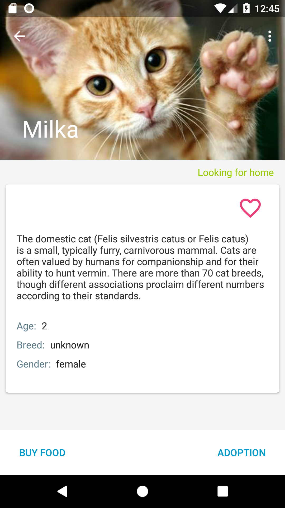

# Pets-Shelter-Demo
This is a sample app that uses:

**Android Architecture Components** (LiveData, ViewModel, LifecycleObserver and LifecycleOwner) for managing UI component lifecycle and handling data persistence.  
**Firebase Database** (NoSQL cloud database and storage) allows to store and sync user's data across multiple devices.  
**Firebase Authentication** provides backend services and ready-made UI libraries to authenticate users to the app.  
**Data Binding** for writing declarative layouts and minimizing the glue code necessary to bind the app logic and layouts.  
**Dagger 2** for dependency injection.  
**Stripe API** for payments (donations) acception, securely collection users' payment information, and charges server-side creation.  
**Webtask** for serverless endpoint.  
**Retrofit 2** for REST api communication.  
**Google Maps API** for displaying location on a map.  
**Google Pay API** for securely requesting any credit or debit card information stored in user’s Google account.  
**Glide** for image loading.  
**Timber** for logging.

## Description
The app is composed of 6 main screens.

### Splash Screen
Retrieves data or updates data from Firebase Realtime Database.

### Sign-in Screen
Allows to sign in users to the app by using FirebaseUI (sign-in flows for email, Google Sign-In). Facebook Login and Twitter Login are also available to support.


### Main Screen
Displays main menu, News, Pets and Shelter Fragments, redirects unauthenticated users to Sign-in Screen.

MainActivity.java  
```java
FirebaseUser user = firebaseAuth.getCurrentUser();
if(user==null)
    navigator.navigateToLogin();
else
    viewModel.reloadUserData(user.getUid());
 ```


### News Fragment, News Details Fragment
Display news, details, stars count, comments and keep track of how many stars and comments a news item has received. 
Authenticated users can star/unstar and comment the news. UI is updated simultaneously.

NewsListFragment.java  
```java
@Override public void onStart() {
    ...
    viewModel.startListeningNews();
}

private void observeViewModel() {
    viewModel.getNews().observe(this, newsResource -> {
        if(newsResource!=null) {
            if(newsResource.status.equals(Status.ERROR))
                SnackbarUtils.showSnackbar(binding.getRoot(), newsResource.message, SnackbarUtils.TYPE_ERROR);
            adapter.replace(newsResource.data);
        }
    });
}

@Override public void onStop() {
    ...
    viewModel.stopListeningNews();
}
```

||

### Pets Fragment, Pets Details Fragment
Display pets list. Users can add pet to favorites and app stores it in Firebase Realtime Database.

PetsListFragment.java  
```java
viewModel.getPets().observe(this, pets -> adapter.replace(pets));
```

PetsViewModel.java  
```java
private LiveData<List<Pet>> pets;
...
public PetsViewModel() {

  pets = Transformations.switchMap(listType, type -> {
              if(TextUtils.isEmpty(type))
                  return AbsentLiveData.create();
              else if(type.equals(AppConstants.FRAGMENT_LIST_TYPE_DOGS))
                  return repository.getDogs();
              else
                  return repository.getCats();
          });
}
```

|

### Map Screen
Displays the shelter's location by using Google Maps API. 


### Donation Screen
Allows users to select payment (donation) management flow. 
App uses Retrofit 2 to make HTTP POST call for the token (representation of those payment details, which can then be submitted to the server for use).

StripeService.java  
```java
@FormUrlEncoded
@POST("donate")
LiveData<ApiResponse<ResponseBody>> chargeDonation(@FieldMap Map<String, Object> fields);
```
DataRepository.java  
```java
public LiveData<ApiResponse<ResponseBody>> createCharge(Map<String, Object> fields) {
  return stripeService.chargeDonation(fields);
}
```

Charges donation by using serverless endpoint [Webtask.io](https://webtask.io/).

```node.js
...
app.post('/donate', (request, response) => {
  var ctx = request.webtaskContext;
  var STRIPE_SECRET_KEY = ctx.secrets.STRIPE_SECRET_KEY;

  stripe(STRIPE_SECRET_KEY).charges.create({
    amount: request.body.amount,
    currency: request.body.currency,
    source: request.body.stripeToken, 
    description: request.body.description
  }, (err, charge) => {
    const status = err ? 400: 200;
    const message = err ? err.message: 'Payment done!';
    response.writeHead(status, { 'Content-Type': 'text/html' });
    return response.end('<h1>' + message + '</h1>');
  });
});
...
```

||

### Adoption Screen
Displays adoption information. User can fill out the adoption application and send it to the shelter (not implemented).


# Author
Eugene Iatsenko @EugeneJAD on GitHub. [LinkedIn](https://www.linkedin.com/in/evgeniyyatsenko/).

# Credits

* The project is inspired by Google Samples' [GithubBrowserSample](https://github.com/googlesamples/android-architecture-components/tree/master/GithubBrowserSample).  
* Logo vectors are created by [Freepik](https://www.freepik.com/)


# License

Copyright 2018 Eugene Iatsenko

Licensed under the Apache License, Version 2.0 (the "License"); you may not use this file except in compliance with the License. You may obtain a copy of the License at

[http://www.apache.org/licenses/LICENSE-2.0](http://www.apache.org/licenses/LICENSE-2.0)

Unless required by applicable law or agreed to in writing, software distributed under the License is distributed on an "AS IS" BASIS, WITHOUT WARRANTIES OR CONDITIONS OF ANY KIND, either express or implied. See the License for the specific language governing permissions and limitations under the License.
